# Forecasting Tool

Ferramenta **local** de forecasting para analistas de BI, SFE e dados. Importe CSV/XLSX
(formato largo, com detecção automática), valide modelos com validação temporal (backtest),
compare métodos, salve seus estudos e exporte os resultados em XLSX. Tudo numa única tela web,
servida por uma API local (FastAPI) + página HTML, sem configurar nada antes de ver o primeiro
número.

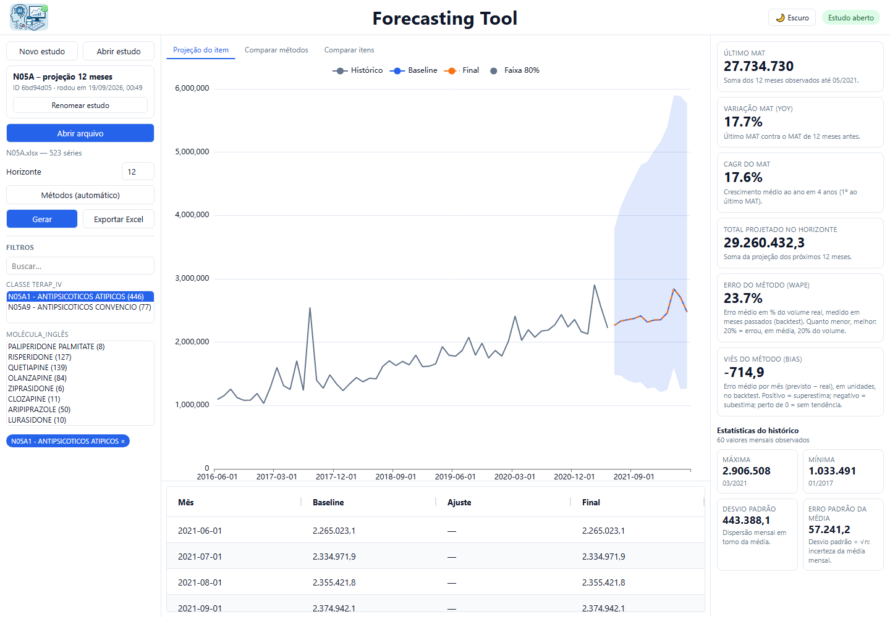

**Escolha de método.** Se você marcar métodos (até 5), a rodada executa **exatamente** esses.
Se não marcar nenhum, o sistema **recomenda o melhor método por item** (menor WAPE em 1 fold de
validação) e mostra qual foi e quais foram as alternativas — nada é escondido, e você pode
comparar todos os que rodaram.

**Os dados permanecem no seu computador.** Não há serviço remoto obrigatório,
autenticação nem banco servidor — apenas Python rodando localmente (o servidor web escuta
só em `127.0.0.1`). A única exceção é o **Assistente** (chat com IA), que é **opcional**, só
funciona se você informar a sua chave do OpenRouter (no `.env` ou na própria tela) e envia ao
modelo escolhido o que está na tela — veja [Assistente](#10-assistente-chat-com-ia).

---

## Início rápido (Windows)

Pré-requisito: [Python 3.12+](https://www.python.org/downloads/) instalado (marque "Add python.exe to PATH" no instalador).

1. Dê **dois cliques** em [`instalar.bat`](instalar.bat) (só na primeira vez) — cria o ambiente virtual e instala as dependências.
2. No terminal, dentro da pasta do projeto:
   ```bash
   .venv\Scripts\python.exe -m api
   ```
   O navegador abre em `http://127.0.0.1:8765`.

### Uso rápido (3 passos)

1. **Abrir arquivo** (`.xlsx` ou `.csv` no formato largo: colunas de texto = dimensões,
   colunas `YYYYMM` = períodos). O formato é detectado sozinho.
2. (Opcional) ajuste o **Horizonte** (padrão 12) e marque os **Métodos** a comparar; depois **Gerar**.
3. Navegue pela árvore, veja gráfico/KPIs/grid e clique em **Exportar Excel**.

Detalhes no [MANUAL.md](MANUAL.md#31-tela-única-uso-rápido).

---

## Guia visual

Os prints abaixo usam o arquivo de exemplo `N05A.xlsx` (523 séries × 60 meses). Para
reproduzir, siga a ordem das seções.

### 1. Tela inicial

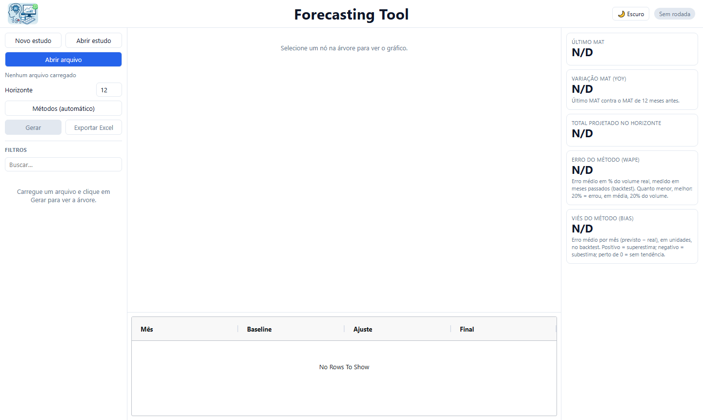

Ao abrir `http://127.0.0.1:8765` a tela está limpa. Tudo o que você controla fica na **barra
lateral esquerda**; o **gráfico e o grid** ficam no centro; os **cards** ficam à direita.
O botão de tema (**Escuro** / **Claro**) e o status da rodada ficam no canto superior direito.

| Área | O que faz |
|------|-----------|
| **Topo** | Logo, título centralizado, tema claro/escuro e status da rodada |
| **Esquerda (cima)** | **Novo estudo** / **Abrir estudo** (estudos salvos no banco), cartão com nome, ID e data/hora do estudo, **Abrir arquivo**, Horizonte, painel **Métodos** (até 5; vazio = sistema recomenda por item), **Gerar** e **Exportar Excel** |
| **Esquerda (baixo)** | Filtros: busca e seletor hierárquico em cascata (ex.: Classe → Molécula → Produto → SKU) com múltipla seleção |
| **Centro** | Gráfico com 3 abas: *Projeção do item*, *Comparar métodos* (todas as curvas do item) e *Comparar itens* (uma linha por item marcado, com o mesmo método) |
| **Direita** | Cards explicados: Último MAT, Variação MAT (YoY), CAGR do MAT (com 36+ meses), Total projetado no horizonte, Erro do método (WAPE), Viés (Bias) e estatísticas do histórico (máxima, mínima, desvio padrão, erro padrão da média) |
| **Baixo** | Grid do horizonte com os valores projetados |

### 2. Abrir arquivo, horizonte e métodos

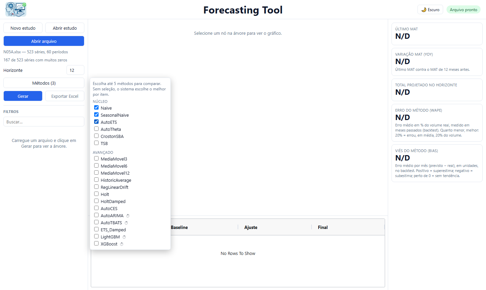

1. Clique em **Abrir arquivo** e escolha o `.xlsx` ou `.csv`. A barra lateral mostra o nome do
   arquivo, o número de séries e períodos e um aviso de qualidade (ex.: séries com muitos zeros).
2. Ajuste o **Horizonte** (meses a projetar; padrão 12).
3. Clique em **Métodos** para abrir o painel flutuante. Marque **até 5** métodos para comparar.
   O ⏱ indica métodos lentos em bases grandes (passe o mouse para ver o aviso). **Sem marcar
   nenhum**, o botão fica em *Métodos (automático)* e o sistema recomenda o melhor método
   por item.
4. Clique em **Gerar**. Uma barra de progresso acompanha a rodada.

### 3. Dar nome ao estudo

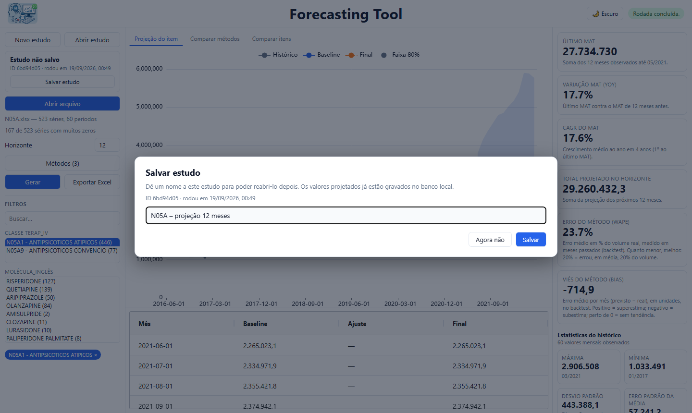

Quando a rodada termina, a tela pede um **nome** para o estudo (já vem sugerido: arquivo +
data). **Enter** ou **Salvar** grava; **Agora não** deixa o estudo sem nome. Os valores
projetados já estão gravados no banco local, então nomear serve para reabrir depois. O cartão
no topo da barra lateral mostra nome, **ID** e **data/hora** do estudo, com o botão
**Renomear estudo**.

### 4. Navegar pelos resultados


- **Filtros (barra lateral, embaixo):** *Buscar* filtra a árvore por texto. Abaixo, um seletor
  por nível da hierarquia (aqui: Classe → Molécula → Produto), **em cascata**: ao escolher uma
  classe, o nível seguinte mostra só o que pertence a ela. Use **Ctrl/Shift + clique** para
  marcar vários. Os itens marcados viram *chips* no fim da lista; clique no chip para removê-lo.
  O chip em destaque (azul-escuro) é o último item marcado e alimenta o gráfico, os cards e o grid.
- **Aba "Projeção do item":** histórico (cinza), projeção (azul/laranja tracejada) e faixa de
  80% de confiança. Passe o mouse sobre o gráfico para ver os valores.
- **Cards da direita:** *Último MAT* (soma dos últimos 12 meses), *Variação MAT (YoY)*, *CAGR do
  MAT* (só com 36+ meses), *Total projetado no horizonte*, *Erro do método (WAPE)* e *Viés
  (Bias)* do backtest, mais as *estatísticas do histórico* (máxima, mínima, desvio padrão e erro
  padrão da média). Cada card traz a explicação embaixo do número.
- **Grid (embaixo):** os valores projetados mês a mês.

### 5. Comparar métodos

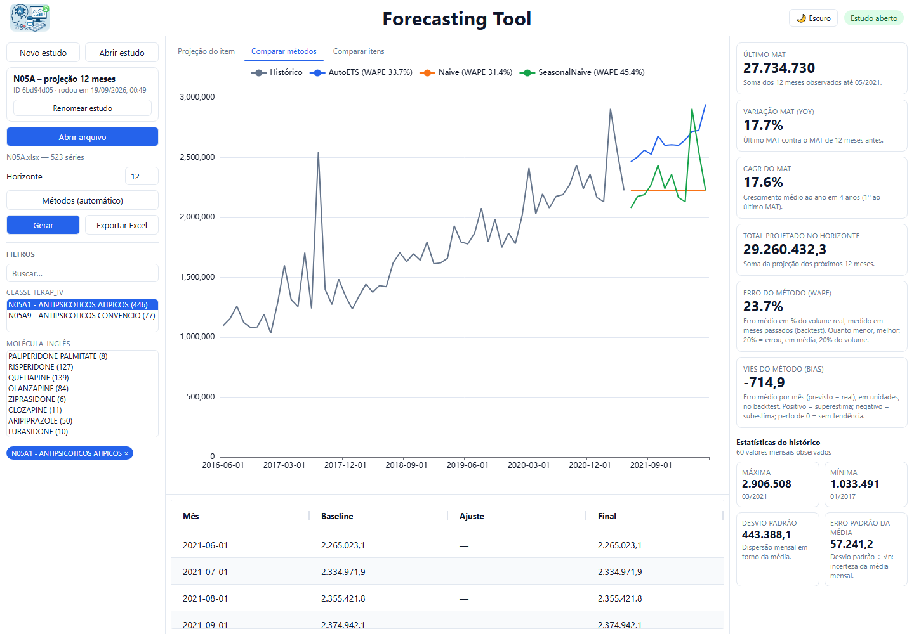

A aba **Comparar métodos** desenha **uma curva por método** rodado para o item selecionado. A
legenda traz o **WAPE de backtest** de cada método (menor = melhor). Nada é escondido: você
vê todos os métodos que rodaram e decide.

### 6. Comparar itens

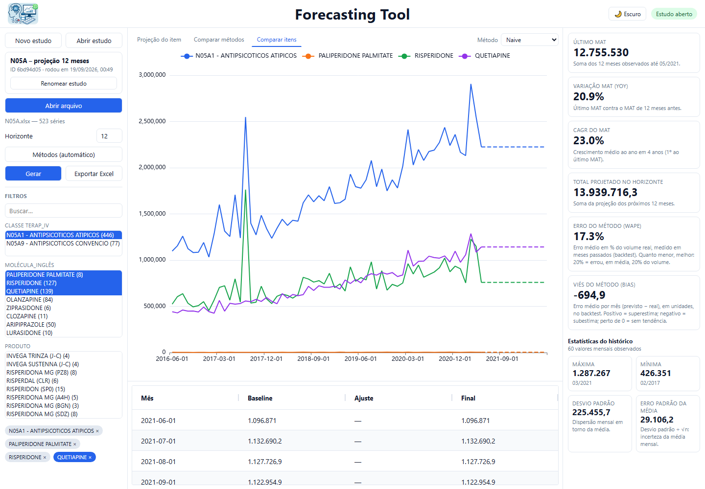

Marque vários itens nos filtros e abra **Comparar itens**: uma linha por item (histórico
contínuo, projeção tracejada), todas com o **mesmo método**, escolhido no seletor
*Método* no canto superior direito do gráfico. Os cards e o grid seguem o item em destaque
(o chip em azul-escuro).

### 7. Estudos: abrir e excluir

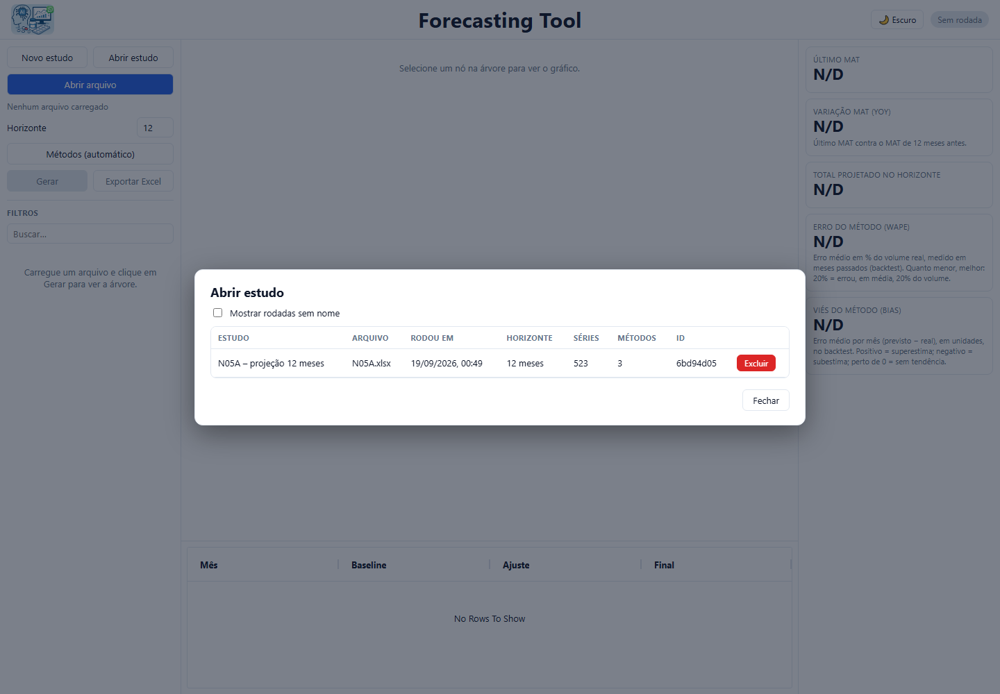

- **Novo estudo** limpa a tela para uma nova projeção (os estudos anteriores continuam no banco).
- **Abrir estudo** lista os estudos rodados (nome, arquivo, data/hora, horizonte, séries,
  métodos e ID). Clique numa linha para reabrir: árvore, gráficos, cards e **Exportar Excel**
  voltam como estavam. Rodadas sem nome ficam ocultas; marque **Mostrar rodadas sem nome**
  para vê-las.
- **Excluir** (por linha) abre uma confirmação:

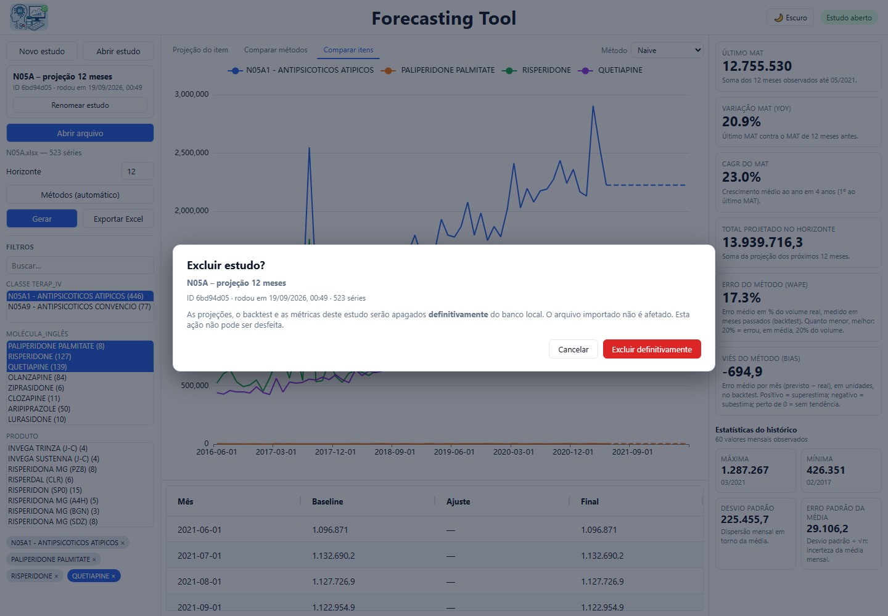

A exclusão apaga do banco local as projeções, o backtest e as métricas daquele estudo (o
arquivo importado e os outros estudos não são afetados) e **não pode ser desfeita**.

### 8. Exportar para Excel

Com um estudo aberto, **Exportar Excel** baixa `forecast_<id>.xlsx`: aba `Historico`, uma aba
por método rodado e `Metadados` (detalhes em [Exportação](#exportação)).

### 9. Tema escuro

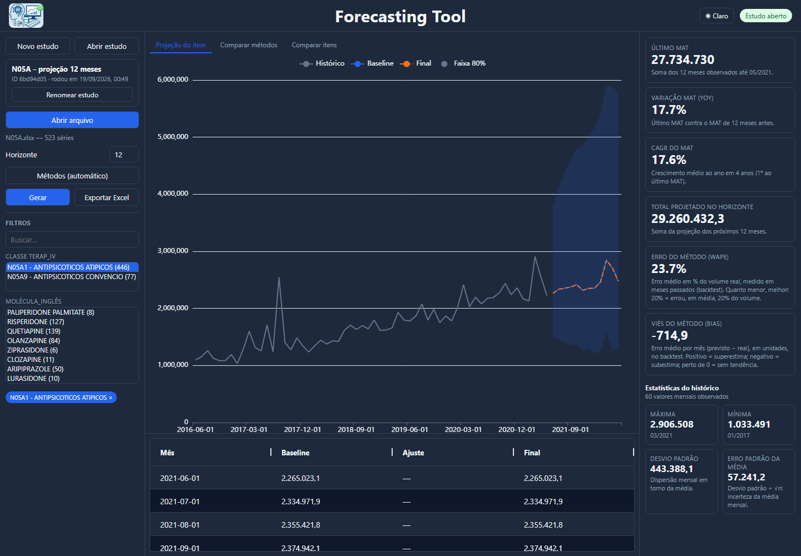

O botão **Escuro** / **Claro** no topo alterna o tema. Sem escolha manual, a tela segue a
preferência do sistema operacional.

### 10. Assistente (chat com IA)

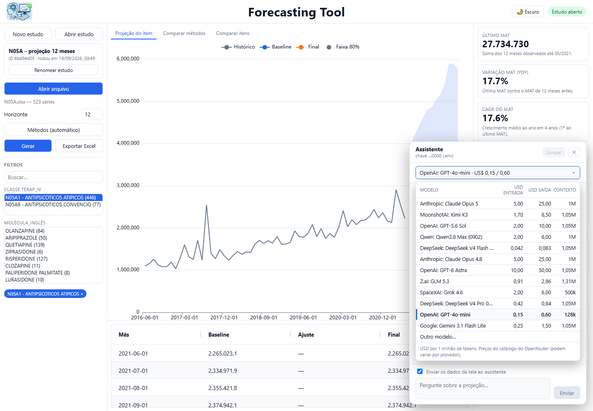

O botão **Assistente** (canto inferior direito) abre um chat que **enxerga o que você está
vendo**: o estudo, o item em foco, os cards, o histórico recente, a projeção e, conforme a aba,
a comparação de métodos ou de itens. Serve para entender e explicar a projeção — o que
significam WAPE e Bias, por que dois métodos divergem, que cuidados tomar. Ele usa **só os
números que estão na tela**; se algo não estiver visível, diz isso e sugere onde clicar.

**Como ativar (duas formas):**

1. **Arquivo `.env` (permanente)** — depois de clonar o repositório, copie
   [`.env.example`](.env.example) para `.env` na pasta do projeto e preencha a chave (crie em
   [openrouter.ai/keys](https://openrouter.ai/keys)) **antes de rodar** a aplicação:

   ```
   OPENROUTER_API_KEY=sk-or-...
   ```

   O arquivo é relido a cada mensagem; se você criá-lo depois, não precisa reiniciar.
2. **Colar a chave na própria tela** — quem não criou o `.env` abre o **Assistente**, cola a
   chave no campo e clica em **Ativar** (o OpenRouter confere a chave, sem gastar créditos).
   Ela fica **na memória do servidor enquanto a aplicação estiver rodando**: vale para todas as
   conversas, estudos e rodadas, inclusive se você recarregar a página, e é **esquecida ao fechar
   a aplicação** (não é gravada em disco, no navegador nem em log). **Esquecer chave**, no
   cabeçalho do painel, a remove antes disso. Se houver chave na tela e no `.env`, vale a da tela.

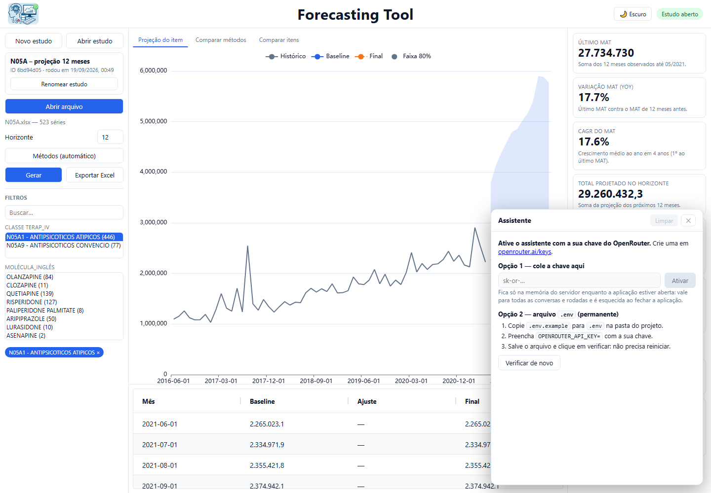

**Escolha do modelo.** O seletor lista modelos com **USD de entrada, USD de saída (por 1 milhão
de tokens) e tamanho do contexto**, lidos do catálogo público do OpenRouter na hora em que você
abre o painel (sem o catálogo, aparecem os valores de 19/09/2026). Os preços variam por provedor
e mudam com o tempo; o catálogo é a fonte de verdade.

| Modelo | USD entrada | USD saída | Contexto |
|---|--:|--:|--:|
| `anthropic/claude-opus-5` | 5,00 | 25,00 | 1M |
| `moonshotai/kimi-k3` | 1,70 | 8,50 | 1,05M |
| `openai/gpt-5.6-sol` | 2,00 | 10,00 | 1,05M |
| `qwen/qwen3.8-max-0902` | 2,00 | 6,00 | 1M |
| `deepseek/deepseek-v4-flash` | 0,042 | 0,084 | 1,05M |
| `anthropic/claude-opus-4.8` | 5,00 | 25,00 | 1M |
| `openai/gpt-6-astra` | 10,00 | 50,00 | 1,05M |
| `z-ai/glm-5.3` | 0,91 | 2,86 | 1,31M |
| `x-ai/grok-4.6` | 2,00 | 6,00 | 500k |
| `deepseek/deepseek-v4-pro` | 0,42 | 0,84 | 1,05M |
| `openai/gpt-4o-mini` (padrão) | 0,15 | 0,60 | 128k |
| `google/gemini-3.1-flash-lite` | 0,25 | 1,50 | 1,05M |

> Valores do catálogo em 19/09/2026. O ID do Qwen é `qwen/qwen3.8-max-0902` (o nome sem o
> sufixo não existe no catálogo). Nos modelos com prompt muito longo alguns provedores cobram
> mais (por exemplo, GPT-5.6 Sol acima de 272 mil tokens de entrada).

**Outro modelo…** (última linha da lista) aceita qualquer ID do catálogo do OpenRouter, com
busca. Para trocar a lista do seletor ou o modelo inicial, use no `.env`
`OPENROUTER_MODELS` (IDs separados por vírgula) e `OPENROUTER_DEFAULT_MODEL`; também existem
`OPENROUTER_MAX_TOKENS` e `OPENROUTER_TIMEOUT`.

**Como usar.** Clique numa **sugestão** ou escreva a pergunta (**Enter** envia, **Shift+Enter**
quebra linha). O contexto é refeito **a cada mensagem**: mude de item ou de aba e o assistente
acompanha. Desmarque **Enviar os dados da tela ao assistente** para conversar só sobre conceitos,
sem enviar nenhum número. **Limpar** apaga a conversa (abrir outro estudo também). Na primeira
vez, um aviso pede ciência de que as mensagens e os dados da tela são enviados ao OpenRouter e
ao modelo escolhido.

> **Custo e privacidade:** cada mensagem consome créditos do **seu** OpenRouter (modelos
> maiores custam mais) e envia ao provedor do modelo a conversa e os dados exibidos na tela.
> Não use com dados que não possam sair da sua organização.
>
> **Antivírus/proxy que interceptam HTTPS:** a ferramenta usa o repositório de certificados do
> Windows (pacote `truststore`, incluído no `requirements.txt`). Se aparecer erro de
> certificado, rode `pip install -r requirements.txt` de novo e reinicie.


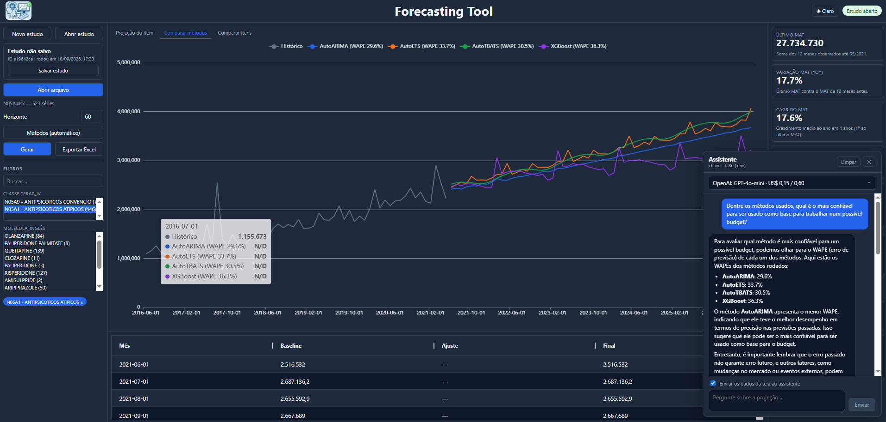
  Aqui um exemplo da resposta do agente quando questionado sobre qual o modelo mais confiável e como justificar tecnicamente a escolha deste modelo ao defender o envio do forecast para a liderança.

---

## Instalação

**Python 3.12** como versão de referência (testado também com **3.13.1**).

```bash
# 1. Crie e ative o ambiente virtual
python -m venv .venv

# Windows
.venv\Scripts\activate

# Linux / macOS
source .venv/bin/activate

# 2. Instale as dependências do núcleo
pip install -r requirements.txt

# 3. (opcional) Aprendizado global — LightGBM/XGBoost via MLForecast
pip install -r requirements-ml.txt
```

No Windows, basta dar dois cliques em `instalar.bat`: ele cria o `.venv` e instala
`requirements.txt` (núcleo). O aprendizado global é opcional.

| Arquivo | Conteúdo | Quando instalar |
|---|---|---|
| `requirements.txt` | Núcleo: `polars`, `statsforecast`, `duckdb`, `openpyxl`, `pandas`, `pyarrow`, `fastapi`, `uvicorn`, `python-multipart`, `httpx`, `truststore` e demais dependências | Sempre — é o mínimo para rodar a ferramenta e o motor estatístico (Naive/SeasonalNaive/AutoETS/AutoTheta/CrostonSBA/TSB/...) |
| `requirements-ml.txt` | `mlforecast`, `lightgbm`, `xgboost` | Só se for usar os métodos `LightGBM`/`XGBoost` (aparecem no painel **Métodos**). **ML é opcional**: sem este arquivo, o restante funciona normalmente. |

---

## Execução

```bash
python -m api
```

Abre `http://127.0.0.1:8765` no navegador. Alternativa sem abrir o navegador:
`python -m uvicorn api.main:app --port 8765`. A documentação interativa dos
endpoints fica em `http://127.0.0.1:8765/docs`.

Os dados de trabalho ficam em `.local/forecast.duckdb` (nunca versionado). O DuckDB permite um
único escritor: **não abra duas instâncias do servidor ao mesmo tempo**. Mudanças em código
Python exigem reiniciar o servidor; arquivos de `web/` só precisam de reload do navegador.

Limites conhecidos: não há formulário de mapeamento manual (o formato do arquivo é
detectado automaticamente) e os valores projetados não são editáveis na tela — ajustes são
feitos no Excel exportado.

---

## Métodos disponíveis

O painel **Métodos** deixa você marcar até 5 métodos por rodada (com ⏱ nos lentos em bases
grandes). Os modelos são do pacote **StatsForecast** (Nixtla), mais LightGBM/XGBoost
opcionais. As tabelas resumem os candidatos e as condições para aparecerem.

> A ferramenta **não escolhe um vencedor às escondidas**: a rodada prevê e persiste todos os
> métodos marcados, e a aba *Comparar métodos* mostra o backtest de cada um para você decidir.

### Núcleo
| Alias | Tipo | Quando aparece |
|-------|------|----------------|
| `Naive` | Baseline | Sempre |
| `SeasonalNaive` | Baseline sazonal | Frequência mensal ou trimestral |
| `AutoETS` | Suavização exponencial automática (nível+tendência+sazonalidade) | Sempre |
| `AutoTheta` | Método Theta | Sempre |
| `CrostonSBA` | Intermitente (Croston-SBA) | Série com ≥ 2 valores positivos e sem negativos |
| `TSB` | Intermitente (Teunter–Syntetos–Babai) | Mesma condição do CrostonSBA |

### Avançado
| Alias | Tipo | Quando aparece |
|-------|------|----------------|
| `MediaMovel3` `MediaMovel6` `MediaMovel12` | Média móvel de janela fixa | Sempre |
| `HistoricAverage` | Baseline de nível médio | Sempre |
| `RegLinearDrift` | Tendência linear (random walk com drift) | Sempre |
| `Holt` / `HoltDamped` | Suavização exponencial com tendência / tendência amortecida | Sempre |
| `ETS_Damped` | ETS com tendência amortecida | Sempre |
| `AutoCES` | Complex Exponential Smoothing | Sempre |
| `AutoARIMA` ⏱ | ARIMA/SARIMA automático | Sempre |
| `AutoTBATS` ⏱ | TBATS (sazonalidade complexa) | Sempre |
| `LightGBM` ⏱ / `XGBoost` ⏱ | Gradient boosting global via MLForecast | ≥ 20 entidades e ≥ 200 linhas treináveis; pacotes de `requirements-ml.txt` instalados |

- Séries com histórico todo zero recebem automaticamente `ZeroBaseline` (previsão zero; não
  selecionável).
- O comprimento da sazonalidade é `auto`: 12 (mensal/MAT), 4 (trimestral) ou 1 (anual).
- Sem explicação teórica detalhada aqui: consulte o [MANUAL.md](MANUAL.md), que descreve o
  funcionamento de cada modelo e quando usá-lo.

---

## Exportação

O botão **Exportar Excel** baixa `forecast_<run_id>.xlsx` (também disponível em
`GET /runs/{run_id}/export.xlsx`), no formato da base de origem, só com as séries mais detalhadas (folhas):

| Aba | Conteúdo |
|-----|----------|
| `Historico` | Colunas de dimensão + uma coluna por período do histórico (`YYYYMM`) |
| Uma aba por método rodado (`AutoETS`, `Naive`, ...) | Colunas de dimensão + uma coluna por período projetado |
| `Metadados` | Configuração da rodada e versões das dependências |

---

## Frequências suportadas

| Frequência | Passo | Histórico máximo | Horizonte máximo |
|------------|-------|:-:|:-:|
| Mensal | MS | 60 meses | 120 meses |
| Trimestral | QS | 20 trimestres | 40 trimestres |
| Anual | YS | 5 anos | 10 anos |
| MAT (direto) | MS | 60 posições | 120 posições |
| MAT (derivado) | Modelado em meses | 60 meses | 120 meses |

---

## Regras centrais do produto

- **Piso zero obrigatório** em toda projeção (valores, agregações e limites dos intervalos).
  Não é desativável.
- **Sem eleição às escondidas**: com métodos marcados, a rodada prevê exatamente esses
  (backtest informativo por método). Sem seleção, o sistema recomenda o melhor por item (WAPE
  em 1 fold) e registra o motivo (`selection_reason`); todos os candidatos ficam persistidos e
  comparáveis.
- Identificadores (EAN etc.) são sempre tratados como **texto**; chaves usam hash SHA-256 estável.
- **Validação temporal** com treino expansivo; nenhum fold consulta o futuro; dados
  imputados no teste não são usados como verdade.
- Os níveis agregados da hierarquia são a **soma das séries mais detalhadas** (bottom-up);
  intervalos de nós agregados ficam nulos com motivo explícito.

---

## Estrutura de arquivos

```
LICENSE                Licença MIT
.env.example           Modelo do .env (chave do OpenRouter para o Assistente)
contracts.py           Dataclasses, enums, schemas e constantes
api/                   API FastAPI (python -m api)
   ├── main.py         App, roteadores e servidor estático de web/
   ├── state.py        Conexão DuckDB única e registro de rodadas em andamento
   ├── datasets.py     Upload com auto-detecção do formato
   ├── runs.py         Rodada em background, progresso e cancelamento
   ├── results.py      Árvore, série agregada e por modelo
   ├── models.py       Catálogo de métodos para o seletor
   ├── exports.py      Download do XLSX (histórico + uma aba por modelo)
   ├── chat.py         Assistente: chamada ao OpenRouter com o contexto da tela
   └── studies.py      Salvar (nomear), listar, reabrir e excluir estudos
web/                   Tela: index.html, app.js, styles.css e vendor/ (Alpine, ECharts, AG Grid — sem CDN)
docs/img/              Prints da tela usados neste README
data_engine/           Leitura, normalização, qualidade, DuckDB e exportação
   ├── dates.py        Grade temporal e conversões de período
   ├── ingest.py       Inspeção/leitura de CSV e XLSX
   ├── profile.py      Diagnóstico de qualidade por série
   ├── normalize.py    Normalização canônica do dataset
   ├── db.py           Schema DuckDB, migrações e persistência
   ├── results.py      Consultas, métricas de backtest e KPIs
   ├── studies.py      Estudos salvos: nome, ID e data/hora de uma rodada
   └── exports.py      Exportação XLSX por modelo
forecast_engine/       Candidatos, CV, previsão final e hierarquia
   ├── models.py       Registro/catálogo de métodos e fábrica StatsForecast
   ├── const.py        Labels PT e ordem/rank dos candidatos
   ├── cv.py           Validação temporal (folds) e avaliação por série
   ├── runner.py       Orquestrador run_forecast (lotes e agregação)
   ├── final.py        Previsão final (reajuste no histórico completo)
   ├── hierarchy.py    Nós e agregação da hierarquia
   ├── ml.py           Aprendizado global (LightGBM/XGBoost via MLForecast)
   ├── metrics.py      Métricas (MAE, RMSE, WAPE, bias) e piso zero
   └── dates.py        Datas do motor
requirements.txt       Dependências do núcleo (versões testadas)
requirements-ml.txt    Complemento opcional: aprendizado global (LightGBM/XGBoost)
.local/                Banco DuckDB e artefatos de runtime (nunca versionado)
```

---

## Dependências principais

| Pacote | Versão | Função |
|--------|--------|--------|
| `fastapi` / `uvicorn` | `>=0.118` / `>=0.34` | API local e servidor da tela |
| `python-multipart` | `>=0.0.20` | Upload de arquivos na API |
| `httpx` | `>=0.27` | Chamada ao OpenRouter (Assistente) |
| `truststore` | `>=0.9` | HTTPS com o repositório de certificados do SO (antivírus/proxy) |
| `polars` | 1.44.2 | Leitura e transformação de dados |
| `statsforecast` | 2.1.1 | Modelos estatísticos (ETS, ARIMA, Theta, Croston…) |
| `duckdb` | 1.1.3 | Persistência local embutida |
| `pandas` | 2.3.3 | Adaptador pontual para interfaces de bibliotecas |
| `openpyxl` | 3.1.5 | Leitura e escrita de XLSX |
| `pyarrow` | 19.0.1 | Serialização columnar |

Métodos globais (opcionais, `requirements-ml.txt`): `mlforecast==1.1.0`, `lightgbm==4.7.0`, `xgboost==2.1.4`.
No front-end (incluídos em `web/vendor/`, sem CDN): Alpine.js, Apache ECharts e AG Grid Community.

---

## Segurança e privacidade

- Nenhum dado de usuário sai do computador, **exceto** ao usar o Assistente (opcional): aí a
  conversa e os dados exibidos na tela vão ao OpenRouter/modelo escolhido, e só se houver
  chave (no `.env` ou digitada na tela). Sem chave, nada é enviado.
- O `.env` (com a chave) está no `.gitignore`. A chave digitada na tela fica só na memória do
  servidor local até a aplicação fechar; em nenhum caso é devolvida ao navegador (só os 4
  últimos caracteres, para identificá-la) nem escrita em disco ou log.
- O diretório `.local/` (incluindo `forecast.duckdb`) está no `.gitignore`.
- A execução local não requer conexão com a internet (só o Assistente precisa dela).
- Nenhuma chave de API é necessária para usar a ferramenta; só o Assistente pede a do OpenRouter.

---

## Licença

Distribuído sob a **licença MIT** — veja o arquivo [LICENSE](LICENSE). Você pode usar,
copiar, modificar e redistribuir, inclusive comercialmente, mantendo o aviso de copyright.

Componentes de terceiros mantêm suas próprias licenças: as bibliotecas de front-end
incluídas em `web/vendor/` (Alpine.js — MIT; Apache ECharts — Apache-2.0; AG Grid
Community — MIT) e as dependências Python instaladas por `requirements*.txt` (por exemplo
StatsForecast — Apache-2.0; Polars e DuckDB — MIT).
